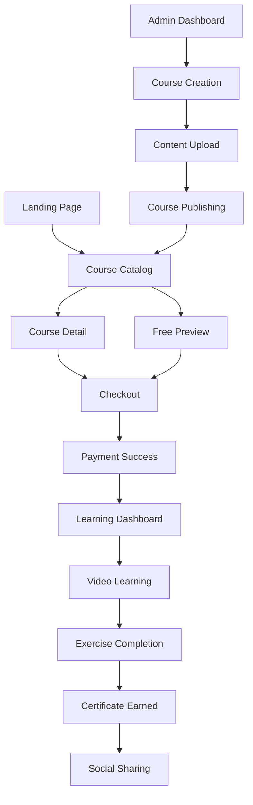

## 1. Product Overview
Hyper Vibe Coding Course is a comprehensive e-learning platform that transforms coding education through interactive video courses, progress tracking, and personalized learning paths. The platform serves aspiring developers and coding enthusiasts who want to master programming skills through structured, engaging content.

The product addresses the gap between theoretical coding knowledge and practical application, providing hands-on projects, real-world scenarios, and community-driven learning experiences to accelerate skill development and career advancement.

## 2. Core Features

### 2.1 User Roles
| Role | Registration Method | Core Permissions |
|------|---------------------|------------------|
| Free User | Email/Social login | Browse limited courses, view previews, basic progress tracking |
| Premium Subscriber | Credit card via Stripe | Full course access, certificates, priority support, offline downloads |
| Instructor | Admin invitation | Create/edit courses, manage content, view analytics |
| Admin | System assignment | Full platform control, user management, revenue analytics |

### 2.2 Feature Module
Our e-learning platform consists of the following main pages:
1. **Landing Page**: Hero section, course catalog preview, testimonials, pricing tiers
2. **Course Catalog**: Search/filter courses, category navigation, course cards with ratings
3. **Course Detail**: Video player, curriculum outline, instructor info, enrollment options
4. **Learning Dashboard**: Progress tracking, enrolled courses, achievements, learning streaks
5. **Video Learning**: Interactive video player, code exercises, quizzes, note-taking
6. **User Profile**: Personal info, subscription status, certificates, learning history
7. **Checkout**: Payment processing, subscription selection, coupon application
8. **Admin Dashboard**: Course management, user analytics, revenue reports, content moderation

### 2.3 Page Details
| Page Name | Module Name | Feature description |
|-----------|-------------|---------------------|
| Landing Page | Hero Section | Display compelling headline, course preview video, CTA buttons for enrollment |
| Landing Page | Course Preview | Showcase featured courses with thumbnails, ratings, and pricing |
| Landing Page | Testimonials | Display student success stories and ratings |
| Landing Page | Pricing Tiers | Present subscription plans with feature comparison |
| Course Catalog | Search & Filter | Enable course discovery by category, difficulty, duration, price |
| Course Catalog | Course Grid | Display course cards with progress indicators and enrollment status |
| Course Detail | Video Preview | Show course trailer with enrollment CTA |
| Course Detail | Curriculum | Expandable lesson list with completion tracking |
| Course Detail | Instructor Info | Display instructor credentials and other courses |
| Learning Dashboard | Progress Overview | Visual progress charts, completion percentages, time spent |
| Learning Dashboard | My Courses | Grid of enrolled courses with continue learning buttons |
| Learning Dashboard | Achievements | Badge system for milestones and skill completions |
| Video Learning | Interactive Player | Custom video player with speed control, captions, quality settings |
| Video Learning | Code Exercises | Embedded code editor with real-time execution and validation |
| Video Learning | Quiz System | Multiple choice and coding challenges with instant feedback |
| User Profile | Personal Info | Editable profile with avatar, bio, and learning preferences |
| User Profile | Subscription | Manage billing, upgrade/downgrade plans, payment history |
| User Profile | Certificates | Downloadable completion certificates with verification codes |
| Checkout | Payment Form | Secure Stripe integration with card input and validation |
| Checkout | Order Summary | Display selected plan, pricing breakdown, and coupon field |
| Admin Dashboard | Course Management | Create/edit courses, upload videos, manage curriculum |
| Admin Dashboard | User Analytics | View user growth, engagement metrics, and retention data |
| Admin Dashboard | Revenue Reports | Track subscriptions, one-time purchases, and revenue trends |

## 3. Core Process
**Student Learning Flow**: User lands on homepage → browses course catalog → views course details → enrolls via checkout → accesses learning dashboard → watches video lessons → completes exercises → earns certificates → progresses through learning path.

**Instructor Content Flow**: Instructor logs in → accesses admin dashboard → creates new course → uploads video content → adds exercises and quizzes → publishes course → monitors student engagement and feedback.

**Revenue Generation Flow**: User selects subscription tier → processes payment via Stripe → gains course access → platform tracks usage → generates recurring revenue → provides affiliate commissions for course referrals.

## 4. User Interface Design

### 4.1 Design Style
- **Primary Colors**: Deep purple (#6B46C1) for primary actions, electric blue (#3B82F6) for accents
- **Secondary Colors**: Dark gray (#1F2937) for text, light gray (#F3F4F6) for backgrounds
- **Button Style**: Rounded corners (8px radius), gradient hover effects, clear call-to-action hierarchy
- **Typography**: Inter font family, 16px base size, responsive scaling for headings
- **Layout**: Card-based design with generous whitespace, sticky navigation, responsive grid system
- **Icons**: Modern line icons from Heroicons, consistent stroke width and style

### 4.2 Page Design Overview
| Page Name | Module Name | UI Elements |
|-----------|-------------|-------------|
| Landing Page | Hero Section | Full-width gradient background, animated text, prominent CTA buttons, course preview modal |
| Course Catalog | Filter Sidebar | Collapsible filter panel, checkbox categories, price range slider, clear filters button |
| Course Detail | Video Header | Responsive video player, course metadata overlay, enrollment status badge |
| Learning Dashboard | Progress Cards | Circular progress indicators, course thumbnails, continue learning buttons, achievement badges |
| Video Learning | Split Layout | 70% video player, 30% interactive sidebar with tabs for notes, resources, discussions |
| Admin Dashboard | Data Tables | Sortable columns, search functionality, bulk actions, export options |

### 4.3 Responsiveness
Desktop-first design approach with mobile optimization. Breakpoints at 640px (mobile), 768px (tablet), 1024px (desktop). Touch-friendly navigation with swipe gestures for course browsing. Progressive web app capabilities for offline learning.

### 4.4 Monetization Features
- **Subscription Tiers**: Free (limited access), Basic ($29/month), Pro ($59/month), Enterprise (custom)
- **One-time Purchases**: Individual course sales, certification exams, premium projects
- **Affiliate Program**: 30% commission on referred subscriptions, custom tracking links
- **Premium Features**: Offline downloads, priority support, 1-on-1 mentoring, job placement assistance
- **Upsell Opportunities**: Course bundles, skill assessments, career coaching, interview preparation
