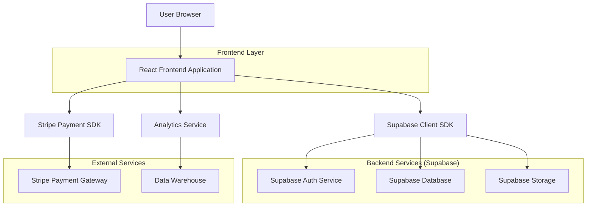
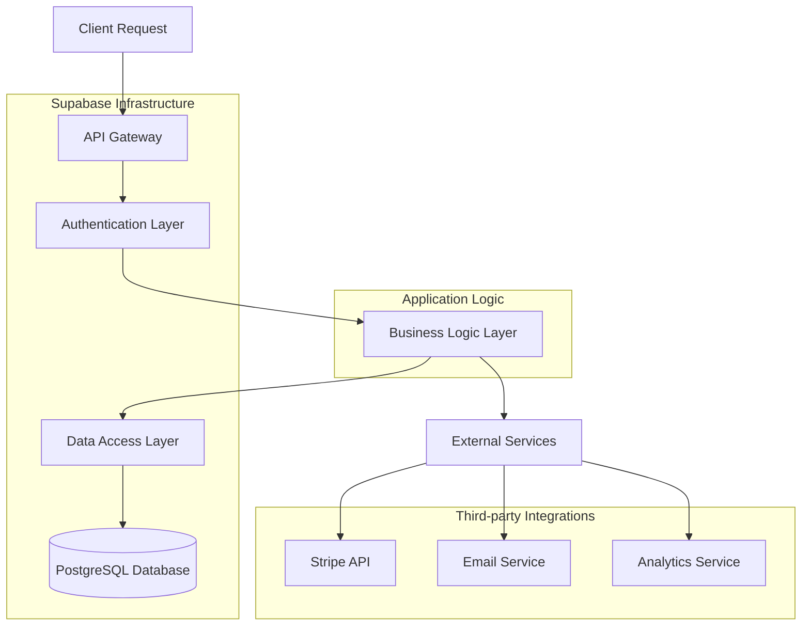
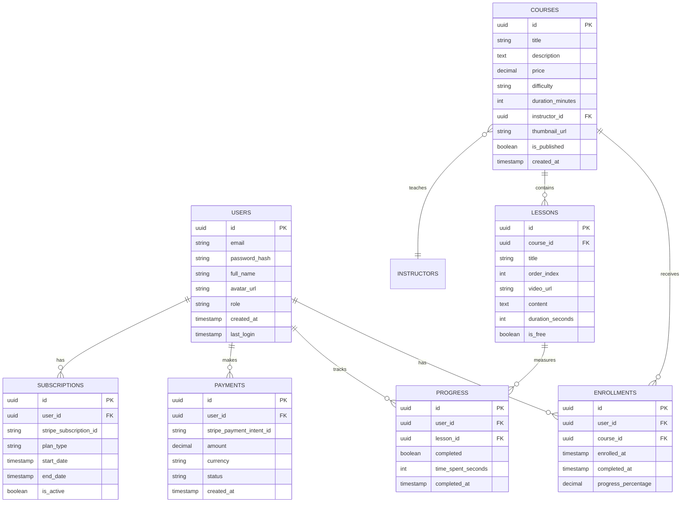

## 1. Architecture Design



## 2. Technology Description
- **Frontend**: React@18 + Tailwind CSS@3 + Vite
- **Initialization Tool**: vite-init
- **Backend**: Supabase (Authentication, PostgreSQL Database, File Storage)
- **Payment Processing**: Stripe SDK
- **Video Streaming**: Custom player with HLS support
- **State Management**: React Context + useReducer
- **Routing**: React Router v6
- **Form Handling**: React Hook Form + Zod validation

## 3. Route Definitions
| Route | Purpose |
|-------|---------|
| / | Landing page with hero section and course previews |
| /courses | Course catalog with search and filtering |
| /courses/:id | Individual course detail page |
| /learn/:courseId | Video learning interface |
| /dashboard | User learning dashboard and progress |
| /profile | User profile and settings |
| /checkout | Payment processing page |
| /admin | Admin dashboard for content management |
| /login | User authentication page |
| /register | New user registration |
| /certificates/:id | Certificate verification and download |

## 4. API Definitions

### 4.1 Authentication APIs
```
POST /auth/v1/token
```
Request:
```json
{
  "email": "user@example.com",
  "password": "securepassword",
  "grant_type": "password"
}
```

### 4.2 Course APIs
```
GET /rest/v1/courses
```
Query Parameters:
- category: string (optional)
- difficulty: string (optional)
- price_max: number (optional)
- search: string (optional)

Response:
```json
{
  "data": [
    {
      "id": "course-uuid",
      "title": "React Mastery",
      "description": "Complete React course",
      "price": 99.99,
      "duration": 1200,
      "difficulty": "intermediate",
      "rating": 4.8,
      "enrolled_count": 1543
    }
  ]
}
```

### 4.3 Progress Tracking APIs
```
POST /rest/v1/progress
```
Request:
```json
{
  "user_id": "user-uuid",
  "course_id": "course-uuid",
  "lesson_id": "lesson-uuid",
  "completion_percentage": 100,
  "time_spent": 1800
}
```

### 4.4 Payment APIs
```
POST /create-checkout-session
```
Request:
```json
{
  "price_id": "price_123",
  "success_url": "https://hypervibe.com/success",
  "cancel_url": "https://hypervibe.com/cancel"
}
```

## 5. Server Architecture Diagram



## 6. Data Model

### 6.1 Data Model Definition


### 6.2 Data Definition Language

```sql
-- Users table
CREATE TABLE users (
    id UUID PRIMARY KEY DEFAULT gen_random_uuid(),
    email VARCHAR(255) UNIQUE NOT NULL,
    password_hash VARCHAR(255) NOT NULL,
    full_name VARCHAR(100) NOT NULL,
    avatar_url TEXT,
    role VARCHAR(20) DEFAULT 'student' CHECK (role IN ('student', 'instructor', 'admin')),
    created_at TIMESTAMP WITH TIME ZONE DEFAULT NOW(),
    last_login TIMESTAMP WITH TIME ZONE,
    updated_at TIMESTAMP WITH TIME ZONE DEFAULT NOW()
);

-- Courses table
CREATE TABLE courses (
    id UUID PRIMARY KEY DEFAULT gen_random_uuid(),
    title VARCHAR(200) NOT NULL,
    description TEXT,
    price DECIMAL(10,2) NOT NULL DEFAULT 0,
    difficulty VARCHAR(20) CHECK (difficulty IN ('beginner', 'intermediate', 'advanced')),
    duration_minutes INTEGER,
    instructor_id UUID REFERENCES users(id),
    thumbnail_url TEXT,
    is_published BOOLEAN DEFAULT false,
    created_at TIMESTAMP WITH TIME ZONE DEFAULT NOW(),
    updated_at TIMESTAMP WITH TIME ZONE DEFAULT NOW()
);

-- Lessons table
CREATE TABLE lessons (
    id UUID PRIMARY KEY DEFAULT gen_random_uuid(),
    course_id UUID REFERENCES courses(id) ON DELETE CASCADE,
    title VARCHAR(200) NOT NULL,
    order_index INTEGER NOT NULL,
    video_url TEXT,
    content TEXT,
    duration_seconds INTEGER,
    is_free BOOLEAN DEFAULT false,
    created_at TIMESTAMP WITH TIME ZONE DEFAULT NOW()
);

-- Enrollments table
CREATE TABLE enrollments (
    id UUID PRIMARY KEY DEFAULT gen_random_uuid(),
    user_id UUID REFERENCES users(id) ON DELETE CASCADE,
    course_id UUID REFERENCES courses(id) ON DELETE CASCADE,
    enrolled_at TIMESTAMP WITH TIME ZONE DEFAULT NOW(),
    completed_at TIMESTAMP WITH TIME ZONE,
    progress_percentage DECIMAL(5,2) DEFAULT 0,
    UNIQUE(user_id, course_id)
);

-- Progress table
CREATE TABLE progress (
    id UUID PRIMARY KEY DEFAULT gen_random_uuid(),
    user_id UUID REFERENCES users(id) ON DELETE CASCADE,
    lesson_id UUID REFERENCES lessons(id) ON DELETE CASCADE,
    completed BOOLEAN DEFAULT false,
    time_spent_seconds INTEGER DEFAULT 0,
    completed_at TIMESTAMP WITH TIME ZONE,
    UNIQUE(user_id, lesson_id)
);

-- Payments table
CREATE TABLE payments (
    id UUID PRIMARY KEY DEFAULT gen_random_uuid(),
    user_id UUID REFERENCES users(id) ON DELETE CASCADE,
    stripe_payment_intent_id VARCHAR(255) UNIQUE,
    amount DECIMAL(10,2) NOT NULL,
    currency VARCHAR(3) DEFAULT 'USD',
    status VARCHAR(20) DEFAULT 'pending',
    created_at TIMESTAMP WITH TIME ZONE DEFAULT NOW()
);

-- Subscriptions table
CREATE TABLE subscriptions (
    id UUID PRIMARY KEY DEFAULT gen_random_uuid(),
    user_id UUID REFERENCES users(id) ON DELETE CASCADE,
    stripe_subscription_id VARCHAR(255) UNIQUE,
    plan_type VARCHAR(20) NOT NULL,
    start_date TIMESTAMP WITH TIME ZONE DEFAULT NOW(),
    end_date TIMESTAMP WITH TIME ZONE,
    is_active BOOLEAN DEFAULT true
);

-- Create indexes for performance
CREATE INDEX idx_users_email ON users(email);
CREATE INDEX idx_courses_instructor ON courses(instructor_id);
CREATE INDEX idx_courses_published ON courses(is_published);
CREATE INDEX idx_lessons_course ON lessons(course_id);
CREATE INDEX idx_enrollments_user ON enrollments(user_id);
CREATE INDEX idx_enrollments_course ON enrollments(course_id);
CREATE INDEX idx_progress_user ON progress(user_id);
CREATE INDEX idx_progress_lesson ON progress(lesson_id);
CREATE INDEX idx_payments_user ON payments(user_id);
CREATE INDEX idx_subscriptions_user ON subscriptions(user_id);

-- Row Level Security (RLS) policies
ALTER TABLE courses ENABLE ROW LEVEL SECURITY;
ALTER TABLE lessons ENABLE ROW LEVEL SECURITY;
ALTER TABLE enrollments ENABLE ROW LEVEL SECURITY;
ALTER TABLE progress ENABLE ROW LEVEL SECURITY;

-- Grant basic read access to anonymous users
GRANT SELECT ON courses TO anon;
GRANT SELECT ON lessons TO anon;

-- Grant full access to authenticated users
GRANT ALL PRIVILEGES ON enrollments TO authenticated;
GRANT ALL PRIVILEGES ON progress TO authenticated;
GRANT SELECT ON courses TO authenticated;
GRANT SELECT ON lessons TO authenticated;
```

## 7. Security Considerations
- **Authentication**: JWT tokens with refresh mechanism
- **Authorization**: Role-based access control (RBAC)
- **Data Encryption**: SSL/TLS for data in transit, encryption at rest for sensitive data
- **Input Validation**: Server-side validation with Zod schemas
- **Rate Limiting**: API rate limiting to prevent abuse
- **CORS**: Configured for secure cross-origin requests
- **SQL Injection**: Parameterized queries via Supabase
- **XSS Protection**: Content Security Policy headers
- **Payment Security**: PCI DSS compliance through Stripe

## 8. Performance Optimization
- **Caching**: Redis for session management and frequently accessed data
- **CDN**: CloudFront for static assets and video content
- **Lazy Loading**: Component-level code splitting
- **Image Optimization**: WebP format with responsive sizing
- **Database Indexing**: Strategic indexes on frequently queried columns
- **API Response Compression**: Gzip/Brotli compression
- **Frontend Bundle Optimization**: Tree shaking and minification
